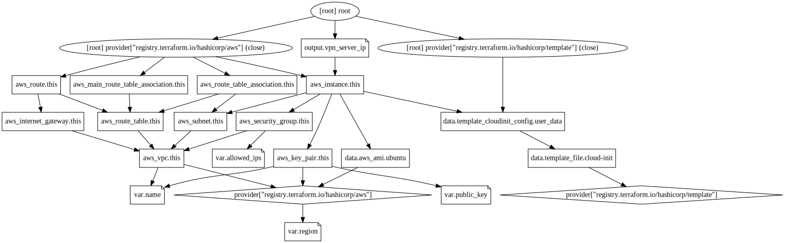

# InstaWire

Spin up your own private VPN service in any AWS region.

**PLEASE NOTE** This creates resources in your AWS account and you may be charged until you stop your service. Use at your own risk/wallet.

## Requirements
   * An AWS account (https://aws.amazon.com) and credentials (hint: use something awesome like https://github.com/99designs/aws-vault to manage these)
   * Terraform >= 1.1.8 (https://www.terraform.io/downloads)

## Usage

To start running a new VPN service:

    ./runme.sh start

*Import the resulting `aws-*.conf` file in `config/` directory into your WireGuard client and connect.*

To stop running the VPN service run the following in your terminal:

    ./runme.sh stop

### Commands

* help - *Show this file*
* test - *Run an automated test to see if you are able to create a VPN service and an accompanying config file*
